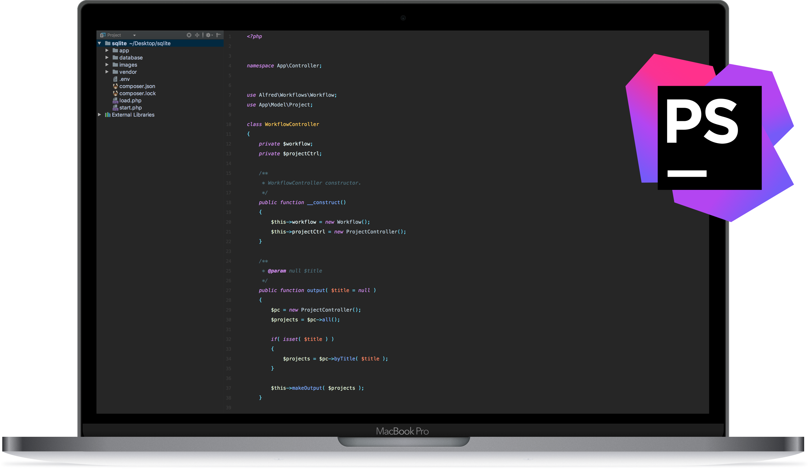
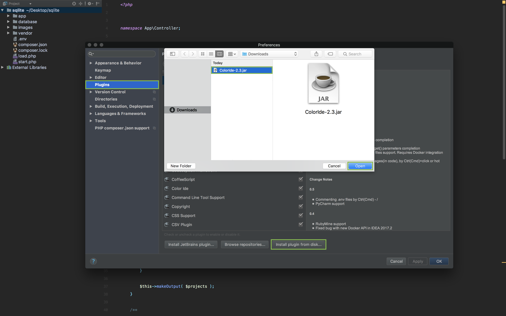

# CleanDark color scheme for PHPStorm

CleanDark is a simple color scheme for PHPStorm, as i have make with combination of *Material Oceanic theme* and the *Color IDE Plugin*.

---

### Installation
##### Step one
1. Download or clone this repository.
2. Open PHPStorm and go to File->Import Settings...
3. Find the myPhpStormTheme.jar file and then import it.

##### Step two
1. Download Color IDE Plugin from https://plugins.jetbrains.com/plugin/7055-color-ide.
2. Open PHPStorm and go to Preferences->Plugins->Install plugin from disk...
3. Find the Coloride.jar file and then open it.
4. Restart PHPStorm

##### Step three
1. Open PHPStorm and go to View and then hide

---

### Screenshots

